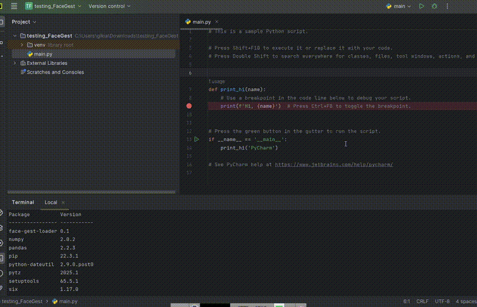

# FaceGest: A Comprehensive Facial Gesture Dataset for Human-Computer Interaction


## Overview
**FaceGest** is a novel dataset designed for advancing research in **facial gesture recognition** for **Human-Computer Interaction (HCI)**. It includes a diverse collection of facial expressions, micro-expressions, and head movements captured in various lighting conditions and backgrounds, enabling robust model training and evaluation.

## Key Features
- **Diverse Expressions:** Includes a wide range of facial gestures (smiles, frowns, eyebrow raises, head nods, etc.).
- **High-Quality Annotations:** Carefully labeled with timestamps and expression categories.
- **Multi-Modal Data:** Contains RGB videos, depth maps, and landmark annotations.
- **Realistic Scenarios:** Captured in different lighting conditions and perspectives.

## Dataset Access
This dataset has three forms. 1) Deep Features-Based 2) Depth-Maps 3) RGB Labeled Videos
For 1) Deep Feautres-Based Version, install "face-gest-library" using "pip" as shown in the following sections. 
Also watch video tutroials given at the end, in case of difficulty.

For 2) Depth-Maps 3) RGB Labeled Videos
A request can be made to the authors, please fill out the following form:
[Request FaceGest Dataset](https://example.com/request-form)

Once your request is approved, you will receive download instructions via email.

## Dataset Structure
The dataset is organized as follows:
```
FaceGest/
├── videos/              # Raw video recordings
├── images/              # Extracted keyframes
├── annotations/         # Facial landmarks and expression labels
├── depth/               # Depth maps 
├── metadata/            # Subject details and conditions
└── README.md            # Project documentation
```

## Usage
### 1. Install Dependencies
Ensure you have the required libraries installed:
```bash
pip install tensorflow opencv-python numpy pandas mediapipe
```
### 2. Download and Load FaceGest
```bash
pip install face-gest-loader
```
### 3. Load and Visualize Samples (Deep Features Mediapipe-based)
```bash
from face_gest_loader import load_face_gest

df  = load_face_gest("Deep-Features-Mediapipe")
print(df)
```
### 4. Load and Visualize Samples (Deep Features SqueezeNet-based)
```bash
from face_gest_loader import load_face_gest

df  = load_face_gest("Deep-Features-SqueezeNet")
print(df)
```
### 5. Load and Visualize Samples (Deep Features Inception-based)
```bash
from face_gest_loader import load_face_gest

df  = load_face_gest("Deep-Features-Inception")
print(df)
```
### 6. Watch Video Tutorial for (Downloading and Loading FaceGest)


### 7. Watch Video Tutorial for (Using FaceGest)


## Benchmark Results
We evaluated FaceGest using the following models:

| Model        | Accuracy (%) | Precision (%) | Recall (%) |
|-------------|------------|--------------|------------|
| **Mediapipe**  | XX.XX      | XX.XX        | XX.XX      |
| **InceptionV4**| XX.XX      | XX.XX        | XX.XX      |
| **SqueezeNet** | XX.XX      | XX.XX        | XX.XX      |


## Applications
- **Human-Computer Interaction (HCI)**
- **Emotion Recognition**
- **Gesture-Based UI/UX Design**
- **Assistive Technologies**
- **Affective Computing**

## Citation
If you use **FaceGest** in your research, please cite:
```
@inproceedings{Yaseen2025FaceGest,
  author    = {Yaseen and Sonain Jamil},
  title     = {FaceGest: A Comprehensive Facial Gesture Dataset for Human-Computer Interaction},
  booktitle = {conference},
  year      = {2025}
}
```

